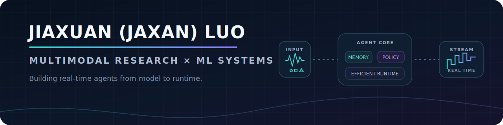

  

  <a href="https://scholar.google.com/citations?user=bdstD5kAAAAJ&hl=en">Google Scholar</a> ·
  <a href="https://www.linkedin.com/in/jiaxuanluo/">LinkedIn</a> ·
  <a href="mailto:luojiaxuan1215@gmail.com">Email</a>

I'm a research engineer focused on **streaming multimodal systems**—real-time speech/omni models, post-training, and high-performance inference.

I work across model and systems research: developing learning and agent capabilities for live multimodal streams, then making them run efficiently under tight latency, memory, and reliability constraints.

Currently, I work on efficient TPU/GPU inference for autonomous-driving systems at **Waymo** and contribute to [**SGLang-Omni**](https://github.com/sgl-project/sglang-omni) as a core contributor. Previously, I spent three years at **Alibaba** building large-scale recommendation systems and conducted research with [**Prof. Lei Li**](https://www.cs.cmu.edu/~leili/) at **CMU LTI** on streaming speech and multimodal agents.

## News

- **2026.07** — Released [AutoTerm-SST](https://github.com/luojiaxuan/autoterm-sst), a zero-setup adaptive terminology memory for streaming speech translation, with a [live demo](https://luojiaxuan.github.io/autoterm-sst/) and [screencast](https://github.com/luojiaxuan/autoterm-sst/blob/main/docs/demo_screencast.mp4).
- **2026.07** — Leading the [SGLang-Omni TTS runtime refactor](https://github.com/sgl-project/sglang-omni/issues/985), consolidating reusable scheduling, caching, engine construction, capability metadata, and vocoder infrastructure across model pipelines.
- **2026.04** — [*Is Vibe Coding Safe?*](https://openreview.net/forum?id=qG8g00zRZa) was accepted to **ICML 2026**.
- **2026.02** — Joined **Waymo** as a Machine Learning Engineer.
- **2026.01** — Released [RASST](https://arxiv.org/abs/2601.22777), a retrieval-augmented framework for simultaneous speech translation.
- **2025.01** — Joined [Prof. Lei Li's](https://www.cs.cmu.edu/~leili/) lab at **CMU LTI** as a Research Assistant, working on streaming speech agents, retrieval, and reinforcement learning.

## Selected Work

| Project | What it explores |
| --- | --- |
| [**AutoTerm-SST**](https://github.com/luojiaxuan/autoterm-sst) · [Demo](https://luojiaxuan.github.io/autoterm-sst/) · [Video](https://github.com/luojiaxuan/autoterm-sst/blob/main/docs/demo_screencast.mp4) | Adaptive, budgeted terminology memory for streaming speech translation without per-session glossary setup. |
| [**RASST**](https://arxiv.org/abs/2601.22777) | Cross-modal retrieval over partial speech, with chunk-level terminology hints for a streaming Speech LLM. |
| [**sst-rl-framework**](https://github.com/luojiaxuan/sst-rl-framework) · [HPO paper · ACL 2026 Oral](https://arxiv.org/abs/2604.21045) | Refactored the task-specific HPO/SST trainer into a reusable GRPO framework with modular rollout, rewards, typed adapters, and task plug-ins. |
| [**High-Throughput Streaming Translation**](https://github.com/LeiLiLab/InfiniSST) · [Paper · ACL 2025 Findings](https://arxiv.org/abs/2503.02969) | Built a Ray + FlashInfer PagedAttention engine with dynamic KV-cache eviction, scaling unbounded-speech translation to 32 sessions/GPU with sub-200 ms serving overhead. |
| [**SGLang-Omni**](https://github.com/sgl-project/sglang-omni) · [TTS refactor](https://github.com/sgl-project/sglang-omni/issues/985) · [Selected PRs](https://github.com/sgl-project/sglang-omni/pulls?q=is%3Apr+author%3Aluojiaxuan) | Mixed-chunk scheduling, tensor-parallel correctness, topology-aware collectives, and shared services for multimodal/TTS serving. |
| [**SUSVIBES**](https://github.com/LeiLiLab/susvibes) · [Paper](https://openreview.net/forum?id=qG8g00zRZa) | A real-world benchmark for the security of code generated by software-engineering agents. |

## Experience

| When | Where | Focus |
| --- | --- | --- |
| 2026–present | **Waymo** · Machine Learning Engineer | Efficient TPU/GPU inference, determinism, and memory-aware serving |
| 2026–present | **SGLang-Omni** · Core Contributor | Real-time multimodal inference and TTS runtime systems |
| 2025–present | **CMU LTI** · Research Assistant | Streaming speech agents, retrieval, RL, and efficient inference |
| 2025 | **TikTok** · Research Engineer Intern | Post-training and low-latency serving for reasoning agents |
| 2021–2024 | **Alibaba Group** · Machine Learning Engineer II | Large-scale ranking, policy learning, and distributed inference |

I received an M.S. in Computer Science from **Johns Hopkins University** and a B.S. in Computer Science from **Central South University's Turing Honors Program**.

## Selected Publications

- **Jiaxuan Luo**, Siqi Ouyang, Jiaxing Xu, and Lei Li. [**RASST: Retrieval-Augmented Simultaneous Speech Translation**](https://arxiv.org/abs/2601.22777). 2026.
- Songwen Zhao, Danqing Wang, Kexun Zhang, **Jiaxuan Luo**, Zhuo Li, and Lei Li. [**Is Vibe Coding Safe? Benchmarking Vulnerability of Agent-Generated Code in Real-World Tasks**](https://openreview.net/forum?id=qG8g00zRZa). ICML 2026.
- **Jiaxuan Luo**, Siqi Ouyang, and Lei Li. [**AutoTerm-SST: Adaptive Terminology Memory with Zero Session-Time Setup for Streaming Speech Translation**](https://github.com/luojiaxuan/autoterm-sst). EMNLP 2026 System Demonstrations, under review.

  If you are working on real-time multimodal agents or efficient inference, I would love to compare notes.

